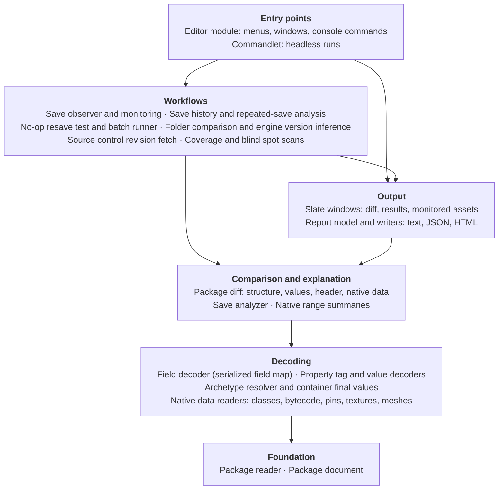
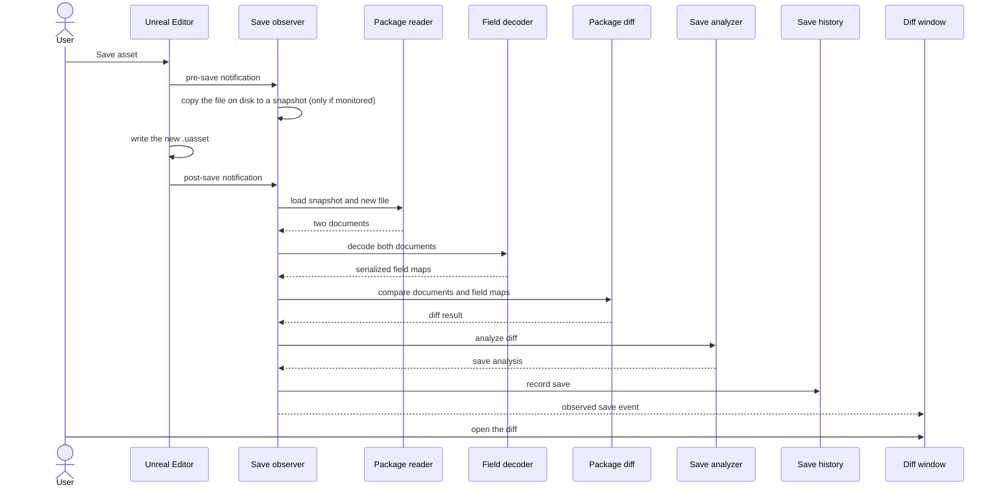
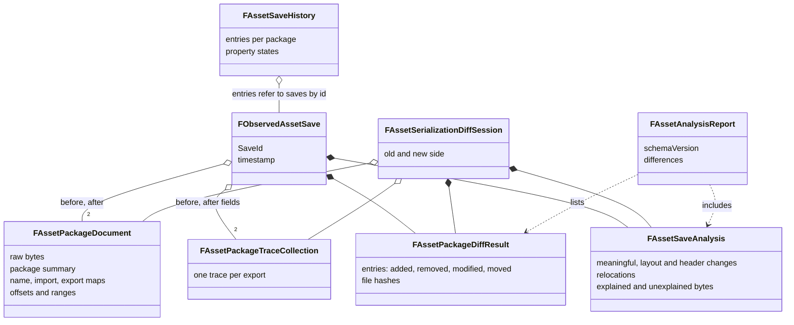

# Architecture

Everything the plugin knows comes from the **bytes of the package files**. It reads them, decodes what it can, compares two versions, explains the difference, and shows it. No engine code is modified and no live serialization is traced.

## The pipeline

```text
.uasset / .umap  (and .uexp beside it)
        |
   1.   Read          FAssetPackageReader        ->  FAssetPackageDocument
        |
   2.   Decode        property and native data decoders
        |             (tags, values, classes, meshes, textures, ...)
        |             Serialized field map: which bytes are what
        |
   3.   Compare       structural diff + semantic diff
        |             (two documents in, one diff out)
        |
   4.   Explain       FAssetSaveAnalyzer
        |             (what the save means; how much is explained)
        |
   5.   Remember      save history and repeated-save analysis
        |
   6.   Show / write  SAssetSerializationDiff (Slate), reports, commandlet
```

1. **Read.** The reader parses the header (summary, name, import and export maps) and keeps the raw bytes with the offsets of every region. The result is a *document*.
2. **Decode.** The bytes of each export are mapped to meaning: property tags and values first, then the native data that follows them (see [Native data](NativeData.md)). Where nothing can be decoded, the range stays marked `<native / undecoded>`.
3. **Compare.** Two documents are compared as structure (fields, names, imports, exports, payloads) and as meaning (properties matched by identity, containers by key or sequence). None of this depends on the UI.
4. **Explain.** The analyzer turns the diff into an answer: which changes are meaningful, which are only layout, which exports merely moved, and how many changed bytes remain unexplained.
5. **Remember.** Observed saves of monitored assets are kept, so the same property can be followed across saves.
6. **Show.** The same results feed the diff window, the text, JSON and HTML reports, and the headless commandlet.

## Diagrams

### Components

Layers, top to bottom. An arrow means "uses": a layer only uses the ones below it. The UI and the commandlet are thin, and start the same workflows.



### An observed save

What happens when a monitored asset is saved in the editor.



### Main data types



## Where the code is

`Source/AssetSerializationInspector/` has a `Public` and a `Private` folder with the same layout:

| Folder | What is in it |
|---|---|
| `Readers` | `FAssetPackageReader` and the bounded readers it uses |
| `Model` | `FAssetPackageDocument` (a parsed package) and the header layout (`AssetPackageHeaderLayout`) |
| `Trace` | the serialized field map: known ranges inside an export payload |
| `Serialization` | the decoders: property tags and values, archetype resolver, container final values, unversioned properties, schemas from live reflection, and the native data readers (bytecode, graph pins, textures, meshes, morph targets) |
| `Diff` | the structural diff, the decoded value diff, byte diff and diff filters |
| `Save` | the save observer and history, the save analyzer, repeated-save analysis, the no-op resave test and the batch runner |
| `Summary` | the description of a native range by class (`AssetExportSummary`) |
| `Compare` | folder comparison, engine version inference, source control comparison |
| `Report` | the format-independent report model and the text, JSON and HTML writers |
| `Coverage` | the decoder coverage scan and the blind spot scan |
| `Widgets` | the Slate windows |
| `Private/Commandlets` | the headless commandlet |
| `Private/Tests` | the automation tests |

## The main pieces

### `FAssetPackageDocument`

The parsed package: raw bytes, summary, name, import and export maps, and the offsets and ranges of every part. Everything else works from a document.

### Serialized field map (trace)

The known semantic ranges inside an export payload: property tags, property values, native regions, undecoded regions. It is derived from the bytes already stored in the file, **not** from a runtime trace of the engine.

### Value decoder

Turns a serialized property value into a recursive, engine-independent representation. Every decoder is bounded by the property's serialized range, so a bad value cannot read into the next one. Complex values have children and **stable semantic keys**, which the diff uses to match them.

### Diff model

Compares two documents and produces structural and semantic results, independent of Slate. A diff node can stand for a package field, a name, an import, an export, a payload, a property, a nested value, or an unknown or native range.

### `FAssetSaveAnalyzer`

Interprets the diff and says what the save means: semantic property changes, properties that became serialized or omitted, layout-only movement, export relocations, and the residual unexplained or native changes. It attributes changed bytes to properties and infers the cause of a relocation.

### Save history and repeated-save analysis

Recent saves of a monitored asset are kept under a stable save ID. Property paths are aggregated across saves to find recurring, every-save, continuously changing and alternating values, and a past save can reopen its diff.

The package **header** takes part: a header table that changes in many saves (thumbnail table, name map, asset registry data) becomes a pattern like a property, with how often it changed and the bytes it cost.

### Archetype resolver and container final values

`FAssetArchetypeResolver` walks an export's archetype chain through package files and returns the value a property inherits. `AssetContainerFinalValue` applies a decoded set or map delta to that value and says how sure it is. Both are independent of the UI.

### Header layout and header diff

`AssetPackageHeaderLayout` splits a header into regions (including the thumbnail data that no summary field points at). The header diff compares fields and regions and attaches the explanations.

### Reports and runners

`FAssetAnalysisReport` is the format-independent model of one comparison, and the writers turn it into text, JSON or HTML. The no-op resave test (`AssetNoOpResaveTest`), the batch runner (`AssetBatchResave`) and the folder comparison (`AssetFolderComparison`) each condense their per-asset results into small entries and have their own report writers, so large runs stay cheap and every result can be saved.

### Slate UI

`SAssetSerializationDiff` shows the structural diff, semantic values, Save Analysis, Repeated Save Analysis, old and new byte ranges and the hex data. High-level results always navigate back to the low-level diff they came from.

## Checking the decoders

Two console commands scan a folder of packages to find where the decoders fall short.

### Coverage scan

```text
ASI.DecodeCoverage <Folder> [ReportFile]
```

Decodes every tagged property of every export under the folder and ranks **what could not be read**, by how many assets and bytes it affects, plus the bytes that are native or custom serialized, by export class. It also reports how much of each kind of native data was read to its last byte (the numbers in [Native data](NativeData.md) come from here).

The report is written to `Saved/AssetSerializationInspector/Coverage/DecoderCoverage.txt` by default, with a JSON file beside it. Engine content is mostly saved without property tags, so run it on project content to find real gaps.

### Blind spot scan

```text
ASI.DecodeBlindSpots <Folder> [ReportFile]
```

The opposite problem: values the decoder **reads but does not keep**. For each top-level tagged property that decodes completely, the scan changes each byte of the value in turn (one bit, in its own copy of the document), decodes again, and counts the bytes whose change left the decoded value exactly as it was. Such a byte could differ between two saves without the diff showing what changed. Bytes that only describe a struct's layout (the tags naming and sizing each field) are not counted.

The report lists the types with blind bytes, most first, with where they were seen (default `Saved/AssetSerializationInspector/Coverage/DecoderBlindSpots.txt`).

Results so far: on the 5,261 packages of the engine content, the only structure that decoded to a constant text (a pin type) was found this way and fixed. The scan also showed that floats were printed with too few decimals (see below); after that fix a second run over the engine's material functions went from 10,407 blind bytes to 1.

## Decisions that change what you see

### Numbers

Floats, doubles and the vector, rotator, quaternion and box structs are written as the engine writes them (`1.000000`, `X=1.000 Y=2.000 Z=3.000`) whenever that text gives the value back exactly. When it does not (a float one bit away from 1, a location that moved by 0.0001), the fewest digits that do are used (`1.0000001`, `X=100.0001 Y=2.000 Z=0.000`), and only for the numbers that need it. Before this, a change smaller than the printed precision showed as a modified property with the same text on both sides.

### Names and case

Unreal compares names and strings without regard to case, and so does `FString` in C++. A value that changed from `b` to `B` used to be the same value to the inspector, and inside a struct, array, set or map it did not show in the diff. Decoded values, set and map keys, the name map, the header fields, the native data of classes and the repeated-save history are now compared **with** case, so a change of case is reported.

## Why no engine modifications

An early approach considered tracing the live `FLinkerSave` archive while a package is serialized. That gives very precise runtime information but needs a modified engine. The project is meant to work as a normal plugin on vanilla engine builds, so it uses:

- package pre-save and post-save notifications,
- snapshots of the on-disk asset,
- parsing of the package structure and the script serialization ranges,
- offline tagged-property decoding,
- semantic comparison of the decoded payload.

This gives exact byte positions for everything that can be decoded from the package itself, with no dependency on engine changes.
